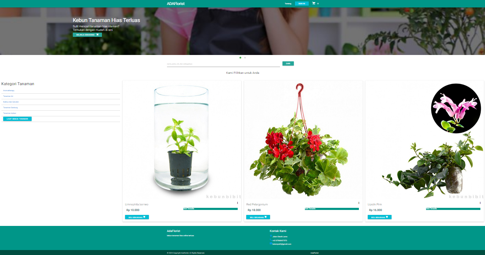
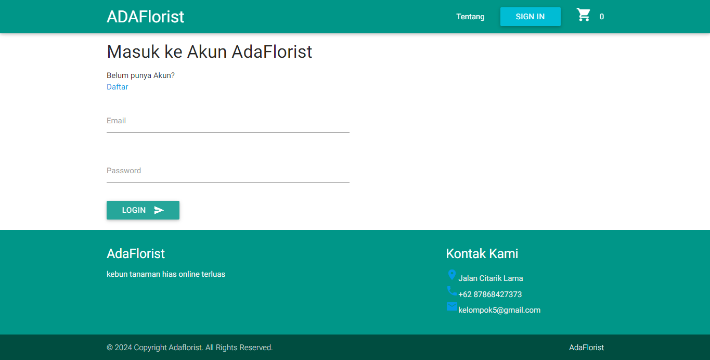
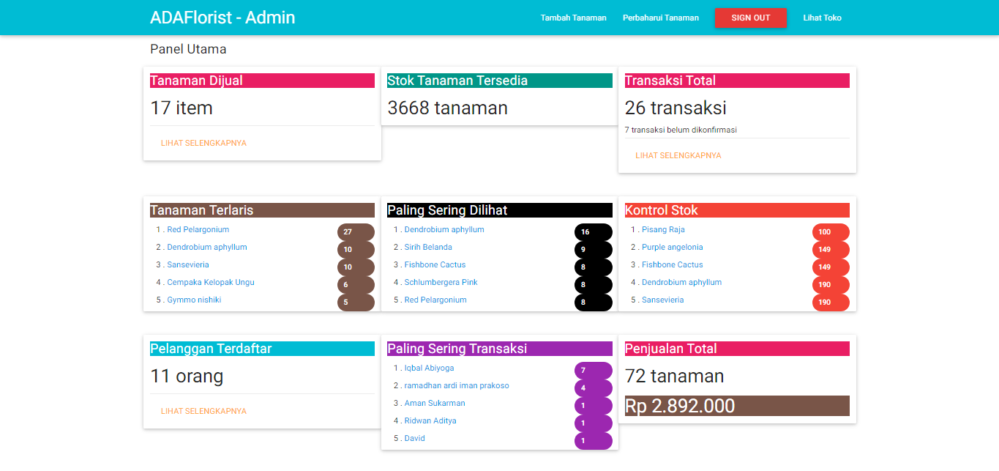
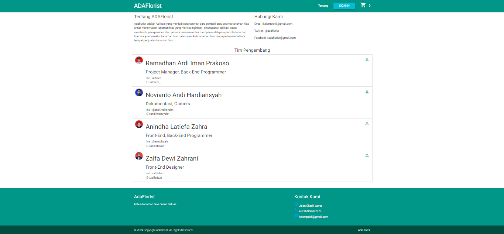
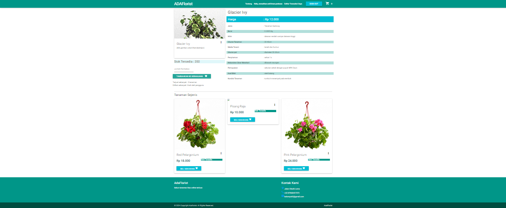
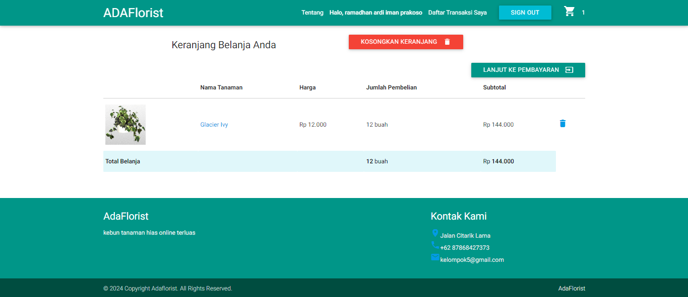
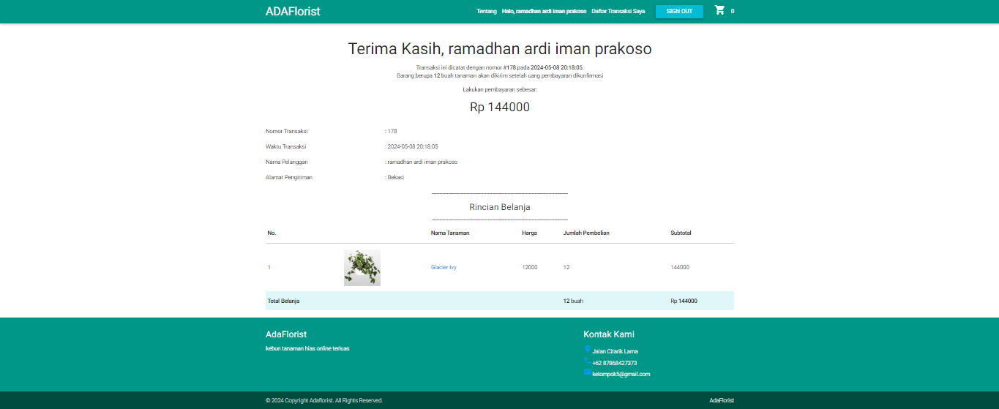

# ADAFlorist - Belanja Bibit Tanaman

### Gambaran Umum Sistem

Toko bunga adalah bisnis yang menjual berbagai jenis bunga, tanaman, dan produk terkait lainnya.
Sistem toko bunga yang efektif harus dapat mengelola inventaris, penjualan, dan layanan pelanggan
dengan cara yang efisien dan menguntungkan.
Berikut adalah beberapa komponen utama dari sistem toko bunga:

### Inventaris:

Sistem inventaris harus dapat melacak jenis bunga dan tanaman yang tersedia, jumlahnya, dan
harganya.
Sistem ini juga harus dapat melacak tanggal pembelian dan kedaluwarsa bunga, sehingga toko
dapat memastikan bahwa mereka selalu memiliki bunga segar dalam stok.

### Penjualan:

Sistem penjualan harus dapat memproses transaksi penjualan, termasuk mencatat item yang
dibeli, kuantitasnya, dan harganya.
Sistem ini juga harus dapat menerima berbagai metode pembayaran, seperti tunai, kartu
kredit, dan debet.

### Layanan pelanggan:

Sistem layanan pelanggan harus dapat melacak informasi pelanggan, seperti nama, alamat,
dan nomor telepon.
Sistem ini juga harus dapat mencatat riwayat pembelian pelanggan, sehingga toko dapat
memberikan rekomendasi yang dipersonalisasi.

### Pemasaran:

Sistem pemasaran harus membantu toko bunga mempromosikan produk dan layanannya
kepada pelanggan potensial.
Sistem ini dapat mencakup situs web, media sosial, dan program email marketing.

### Manajemen Keuangan:

Sistem manajemen keuangan harus melacak pendapatan dan pengeluaran toko.
Sistem ini juga dapat membantu toko membuat anggaran dan melacak profitabilitas

## Screenshots

### Halaman Dashboard User

### Halaman Login

### Halaman Dashboard Admin

### Halaman About Us

### Halaman Toko

### Halaman Keranjang

### Halaman Pembayaran

## Kesimpulan

ADAFlorist adalah toko bunga online yang menawarkan berbagai macam buket bunga yang indah dan layanan pelanggan yang luar biasa. Jika Anda mencari toko bunga di Jakarta, ADAflorist adalah pilihan yang tepat.

Berikut adalah beberapa poin penting tambahan dari website ADAFlorist:

- ADAFlorist menggunakan bunga segar berkualitas tinggi.
- ADAFlorist menawarkan berbagai macam gaya buket bunga, termasuk modern, klasik, dan pedesaan.
- ADAFlorist menawarkan berbagai macam pilihan bunga, termasuk mawar, lili, anggrek, dan tulip.
- ADAFlorist menawarkan berbagai macam harga untuk buket bunga.
- ADAFlorist menawarkan berbagai macam pilihan metode pembayaran.

## Lainnya

### Link Demo Website

### Link Demo YouTube

